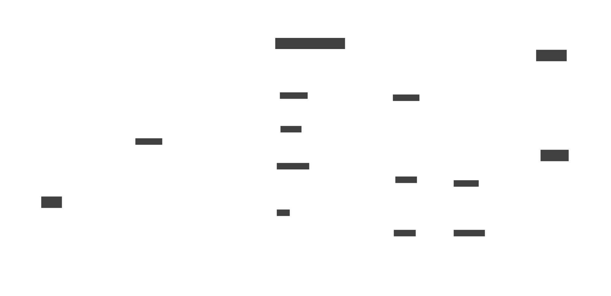

# Architecture

OpenHands Cloud is deployed to a Kubernetes cluster using Helm charts, with minimal dependence on other infrastructure.

## OpenHands components

**OpenHands** has the main entrypoints for using OpenHands agents. This includes the user interface as well as the conversations API and webhooks such as the GitHub / GitLab resolvers.

**Runtime API** manages the Runtime pods. It maintains a pool of waiting runtime pods (called "warm runtimes") and assigns them to conversations on request.

**Runtimes** are the isolated execution environments that run OpenHands agents.

**Image Loader** is a daemon that ensures the Runtime image is cached on every node in the Runtime cluster

## Third-party components

* [Kubernetes](https://kubernetes.io) (compute for OpenHands UI, agent and runtimes)
* [PostgreSQL](https://www.postgresql.org) (databases for several of the components)
* [Redis](https://redis.io) (caching)
* [Keycloak](https://www.keycloak.org) (authentication)
* [LiteLLM Proxy](https://docs.litellm.ai/docs/simple_proxy) (handles connections to AI Language models)
* [Langfuse](https://langfuse.com) (LLM monitoring)
* [Clickhouse](https://clickhouse.com) (event-store used by LangFuses)
* AI Language Models

## Additional Infrastructure

These will be implemented differently depending on which cloud provider you use.

* Load balancer
* Conversation bucket (usually a blob-store like S3)
